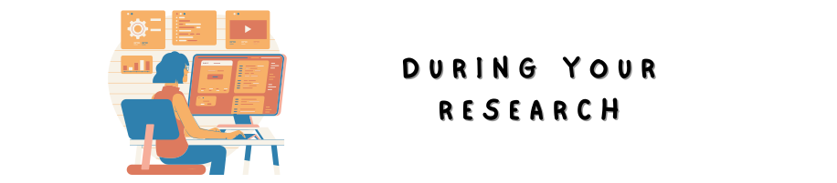

This website provides recommendations and tips for young researchers in the field of Data Science
(DS) and Artificial Intelligence (AI). We divide our guidelines chronologically by focusing on four different phases.

Click on each phase below for a deep dive into how you can tackle them according to the Open Science principles!

