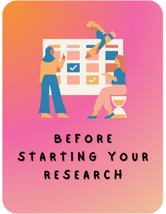
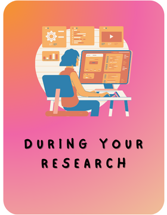
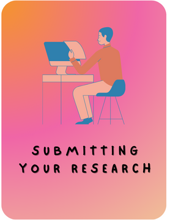
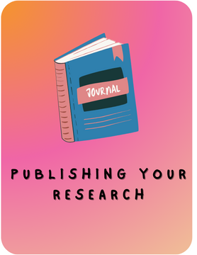

This website provides recommendations and tips for young researchers in the field of Data Science
(DS) and Artificial Intelligence (AI). We divide our guidelines chronologically by focusing on four different phases. Each phase is summarised with a box labelled tl;dr (too long; didn't read). However, we encourage you to read  the recommendations thoroughly before referring to the summaries.

Start your discovery of recommendations and practical tips to fuel your research and publications by navigating these phases using the toolbar or the arrows on the sides of the screen!

     
     
     
     

