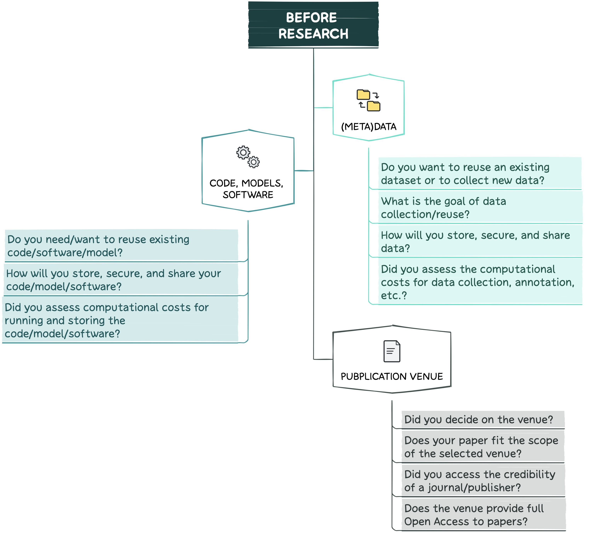

--------------------------------------------------------------------------------------------

  
  Are you at the very beginning of your research project?  
  

 

In this section, you will find recommendations for planning and starting FAIR [^1] [^2] [^3] research in Data Science (DS) and Artificial Intelligence (AI). Here and in the next phases, we will focus on how to ensure FAIRness of DS and AI research artifacts such as (meta)data, models/code/software , and (research) knowledge graphs (KGs/SKGs). 

Before diving into the best practices, first try to answer the questions presented in the figure below. Those are aimed to serve as a reference when you plan the project and as a checklist before you start the actual research. 

>Note: These questions apply to KGs/SKGs as well! 

 

 

[^1]: [Wilkinson, M., Dumontier, M., Aalbersberg, I. et al. The FAIR Guiding Principles for scientific data management and stewardship. Sci Data 3, 160018 (2016). doi: 10.1038/sdata.2016.18](https://doi.org/10.1038/sdata.2016.18)
[^2]: [Barker, M., Chue Hong, N.P., Katz, D.S. et al. Introducing the FAIR Principles for research software. Sci Data 9, 622 (2022). doi: 10.1038/s41597-022-01710-x](https://doi.org/10.1038/s41597-022-01710-x)
[^3]: [Chue Hong, N. P., Katz, D. S., Barker, M., et al. (2022). FAIR Principles for Research Software (FAIR4RS Principles) (1.0). Zenodo. doi: 10.15497/RDA00068](https://doi.org/10.15497/RDA00068)

### (Meta)data
--------------------------------------------------------------------------------------------

1. Decide whether pre-existing data can be used and/or raw data should be collected.
2. Define the goal for data collection/reuse.
3. Before starting to collect/reuse data, assess whether it is a subject to privacy/legal/ethical/copyright restrictions (see [Submission](http://127.0.0.1:4000/jekyll-gitbook/jekyll/2019-04-29-submitting.html)). 
4. In case of data collection:
* Plan an approach and methods (i.e, how data will be collected, the duration of the data collection, etc.).
* Decide on metadata, ontologies and the way data documentation will be provided.
5. Decide on the data storage, security, sharing (e.g., with collaborators) and preservation strategy during and after the project.
6. Assess resources required, e.g., computational costs for collecting, storing and pre-processing data, expenses on annotators. 

>Consider the following data search and collection services:
* RKGs such as [ORKG](https://dl.acm.org/doi/10.1145/3360901.3364435) or [OpenAIRE Graph](https://graph.openaire.eu)
* [Papers With Code](https://paperswithcode.com)  
* [Google Dataset Search](https://datasetsearch.research.google.com)
* [Kaggle](https://www.kaggle.com/datasets)
* [Hugging Face Datasets](https://huggingface.co/docs/datasets/index)
* [Awesome Public Datasets](https://github.com/awesomedata/awesome-public-datasets#agriculture)
* [Data.world](https://data.world/search?context=community&entryTypeLabel=dataset&type=resources)
* [ELG](https://live.european-language-grid.eu)
* Additional useful data collection services are available under Services Lifecycle on [NFDI4DS](https://www.nfdi4datascience.de/services/all/) webpage.

### Code, Models, and Software
--------------------------------------------------------------------------------------------

1. Decide whether existing or/and new code/software/models should be used. Before using an existing resource, check its implementation conditions (e.g., have a look at its licence type). 

>Consider the following code/models/software search services:
* [Hugging Face Models](https://huggingface.co/models)
* [SourceForge](https://sourceforge.net)
* [Software Heritage](https://www.softwareheritage.org)
* [ELG](https://live.european-language-grid.eu)

3. Assess resources required, e.g., computational costs for running and storing code/models/software.
4. Decide on the storage, security, sharing (e.g., with collaborators) and preservation strategy during and after the project.

### Publication Venue
--------------------------------------------------------------------------------------------

1. Find and select the suitable publication venue in advance. 
2. Make sure that your paper fits the scope of the venue and that its content is relevant to the venue’s topics.
3. Assess the credibility of a journal or publisher:
* Check the impact factor of an academic journal, i.e., the yearly average of citations of articles published in the last N years in a given journal. You can search for the journal's impact factor by specifying its full name or International Standard Serial Number (ISSN). Note that this measure should be used to compare journals from the same field. For instance, the Artificial Intelligence journal (AIJ) (impact factor of 14.05 for 2021) vs the Journal of Artificial Intelligence Research (JAIR) (impact factor of 2.441 for 2019). Both are scientific journals on Artificial Intelligence research.
* Check whether articles go through a peer-review process and if it is fully disclosed. 
>Check what peer-review type the venue adheres to: 
>* Single-blinded, author(s) do not know the identity of reviewers; 
>* Double-blinded, both identities of authors and reviewers are anonymised; 
>* Open, identities of authors and reviewers are known by all participants (during or after the review process); 
>* Transparent, reviewers’ report, authors’ response and editors’ decision letters are published along with an accepted paper; 
>* Collaborative, either reviewers work together to review a manuscript or they collaborate with authors to improve a paper;
>* Post-publication, the review is done after a paper has been published.
* Check whether the submission guidelines are clearly stated on the journal/conference webpage.
* Check whether information on ethical considerations such as plagiarism, conflicts of interest, informed consent, and confidentiality is provided.
* Check members of the editorial board. The committee should consist of well-known experts in the field, affiliated with recognised institutions and hold appropriate academic credentials.
* Check if there are fees for publication, this information should be clearly stated.
4. Make sure to pick a publication venue that provides full Open Access to the eventual paper:
* Check the author and copyright policies of the journal/proceedings of the conference. Ideally, the venue permits authors to retain their copyright, meaning that authors are allowed to reuse, distribute, and republish their work. 

>### Summary
><strong>(Meta)data:</strong>
>
>Decide where your data is from, and then make sure it has the right license! If you want to create new data, consider your method, documentation strategy, and storing/preservation mechanism carefully. Don’t forget to assess the required human/computational resources needed for your data. 
>
><strong>Code, models, and software:</strong>
>
>If you are building on existing code, make sure you are allowed to use it. Consider your computational resources and storing/preservation strategies carefully!
>
><strong>Publication venue:</strong>
>
>Choose where you want to publish in advance! Check the call for papers (CfP) and make sure your work fits the topic(s). Make sure that the venue is credible, and that it provides Open Access to papers.
{: .block-tip }

### References
--------------------------------------------------------------------------------------------
