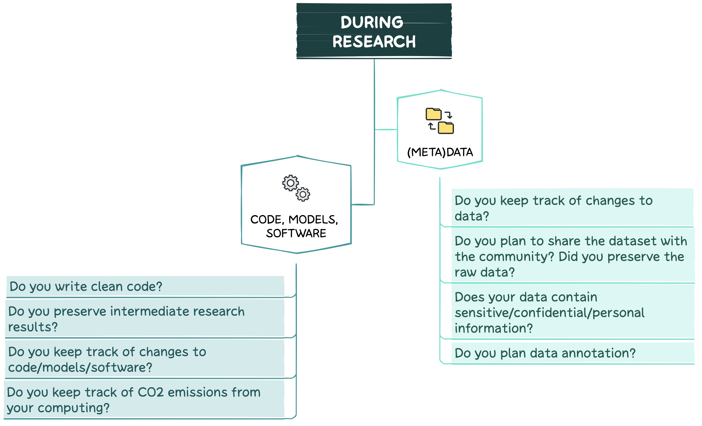

--------------------------------------------------------------------------------------------

Have you already started your research project?

In this section, you will find recommendations on how to ensure FAIRness of DS and AI digital artifacts during your research. The figure below presents the key questions to be addressed at this phase. 

### DATA AND METADATA
--------------------------------------------------------------------------------------------

1. Don’t forget about **Data Version Control (DVC)** and backups to keep track of changes and to avoid data loss.
2. If the dataset is planned to be shared with the community, **preserve** a version of the **raw data**. This way other researchers will be able to pre-preprocess and use it according to their study goals.
3. In case of data with **sensitive/confidential/personal information**:
* Strong **security measures** must be taken to prevent data breaches and leakages. Some of the best practices for data protection can be found [here](https://rdmkit.elixir-europe.org/data_protection). 
* Appropriate measures must be taken to protect the **rights of data subjects** (e.g., anonymisation, pseudonymisation, encryption, aggregation).
4. If **data annotation** is planned:
* Decide on an **annotation level**, **approach** (manual/semi-automatic/automatic) and **tool**.
* Define the required **input/output formats** and their structure.
* Prepare **tag sets/schemas** and **guidelines**.
* Identify **annotation efforts** required (How many annotators? Experts vs crowdworkes?).
* Decide on **Inter Annotator Agreement (IAA)** measures.

### CODE, MODELS AND SOFTWARE
--------------------------------------------------------------------------------------------

1. Follow **clean code principles**[^1], e.g., include unit tests.
2. Don’t forget to save all your **intermediate research results** (e.g., evaluation scores along with model parameters) for future analysis.
3. Use **Version Control (VC)** and **external backups** to keep track of changes and to avoid data loss.
4. Constantly check **energy consumption**. For instance, you can use the [CodeCarbon](https://codecarbon.io) package which estimates the amount of carbon dioxide produced by computing resources and provides some tips on how to decrease emissions.

[^1]: [R. C. Martin.  "Clean Code: A Handbook of Agile Software Craftsmanship," Prentice Hall, Boston, 2008.](https://www.amazon.de/-/en/Robert-Martin/dp/0132350882)

--------------------------------------------------------------------------------------------
