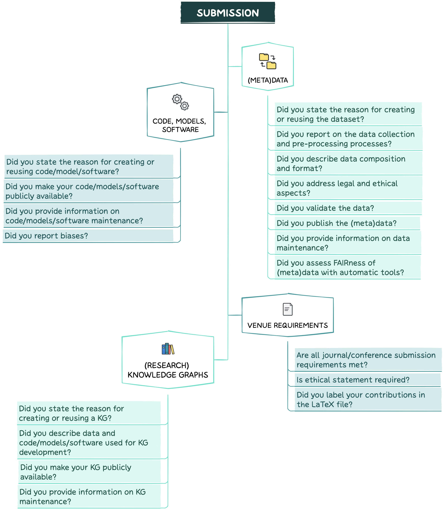

--------------------------------------------------------------------------------------------

Are you about to submit your paper?

In this section, you will find recommendations on how to ensure FAIRness of DS and AI digital artifacts during the submission stage. The figure below presents the key questions to be addressed at this phase.

## VENUE REQUIREMENTS
--------------------------------------------------------------------------------------------

Make sure that all journal/conference **submission requirements are met**, e.g.,:
1. In case of a **double-blinded review**, ensure that your paper does not contain information which reveals your identity (directly or indirectly), e.g.,:
  * Remove any **identifying information** such as title, authors' names, affiliations and emails, acknowledgements, conflict of interest statement, project funding details, etc., from your paper.
  * Do not include **links** pointing **to your personal repository** with code/(meta)data in a paper.
  * Use the **third person** to refer to your previous work.
  * Make sure that figures and tables do not include any reference to **authors’ affiliations**.
  * Ensure that **file names** and **properties** are also anonymised.
  * Better not to share **non-anonymous pre-print** of a manuscript, e.g., in [arXiv](https://arxiv.org), before the anonymity period expires.
2. If applicable, do not forget to include an **ethical statement**.
3. In case you are using LaTeX, make sure to **label your contributions** (e. g., research problem, objective, method, etc.) in the LaTeX file using the [SciKGTeX](https://ctan.org/pkg/scikgtex?lang=en) package. This will allow an automatic extraction and import of mentioned metadata to any Research KG (RKG).

## DATA AND METADATA
--------------------------------------------------------------------------------------------

### Motivation
State the **reason** for creating or re-using a dataset, e.g., for specific task(s), a gap in the research field that needed to be filled, etc.

### Data composition and format
1. Describe **data type** (raw vs pre-processed).
2. State **instances type/format** (e.g., text documents, images, videos, audio files; pdfs, csvs, html, etc.).
3. Make sure to report the **language of any linguistic data**, even if you are reusing common datasets or benchmarks (**#benderrule**).
4. Provide information about the total **number of observations** and (if applicable) **label distribution**.
5. Describe data with **rich metadata**:
* Metadata should clearly and explicitly include the **persistent identifier (PID)** (e.g., UUID or Hash based identifiers) of the data it describes. For more detail on PIDs see [FAIRCOOKBOOK](https://faircookbook.elixir-europe.org/content/recipes/findability/identifiers.html).
* (Meta)data should be in a **formal, accessible, shared and broadly applicable language** for knowledge representation (e.g., you can use RDF, OWL, DAML+OIL or JSON LD). There are many tools for converting non-RDF data to RDF, e.g., [ConverterToRdf](https://www.w3.org/wiki/ConverterToRdf) or [RdfAndSql](https://www.w3.org/wiki/RdfAndSql).
* (Meta)data should include **qualified references** to other (meta)data. You should establish meaningful links between the datasets by clearly stating: **i)** whether one dataset builds on another dataset; **ii)** whether additional datasets are needed to complete a given data; **iii)** whether any complementary information is stored in a different dataset.
* If applicable, provide details of **train/validation/test splits**.

### Data collection 
1. Describe the data **collection method** (e.g., manual human annotation/automatic/semi-automatic, API, etc.). In case of human annotation:
* Report **how annotators were recruited** with detail. For instance, if by crowdsourcing, provide the name of the specific platform that was used.
* Provide **information about annotators** (crowdworkers, students, linguists, etc.; number of annotators, their age, demographic details, population, etc.).
* Discuss how annotators were paid and if such **payment** is adequate given the annotator demographic (e.g., country of residence).
* Report the full text of **instructions/annotation guidelines** given to participants or that the participants have been trained with.
* Describe the **means** and frequency **of communication** with annotators.
* Provide **schemas** used for annotation.
* Describe/reference **annotation tool(s)** used (with version details).
* Provide the **IAA measure and score**.
* State whether and how **consent** was obtained from people whose data was used/curated. For instance, if data was collected via crowdsourcing, did you explain to the crowdworkers how the data will be used?
2. Provide **time-frames** of both the data collection process and the **content** of the dataset.
3. State the **data source(s)** (e.g., Twitter, Facebook, Reddit, etc.). If data was collected by third parties, do not forget to **cite authors/creators**.
4. Provide information on whether your dataset contains **all instances or** if it is a **sample**. If the latter, describe the **sampling strategy** (e.g., deterministic, probabilistic, etc.).
5. State whether (and why) there is any **information missing** from the dataset (this does not include intentionally dropped instances; it might include, e.g., redacted text, withheld documents).
6. Make sure that **all files are labeled clearly** so readers understand the contents of, and difference between, the files.
7. Report whether there are any known **errors**, sources of noise or redundancies in your dataset.

### Data pre-processing 
1. Describe the **pre-processing steps** (e.g., tokenization, part-of-speech tagging, stopwords removal, resolving imbalanced data classes, etc.).
* Report **packages** used with their versions, parameter settings and accessibility (free/commercial/limited access, etc.).
* **Cite the original work** for packages used in your code. If no paper exists, include a URL/Digital Object Identifier (DOI)/PID to the website or the repository.
* If you modified an existing library, **report the changes** you made.
2. State whether **raw data** is available in addition to a cleaned corpus.

### Legal/ethical considerations
1. In case data **falls** under ethical/legal restrictions:
* If a dataset relates to people or was generated by people, state whether they were informed about the data collection and **consent**.
* State whether a dataset contains **sensitive/confidential/personal information** (e.g., names, phone numbers, credit card numbers, addresses, user names). If yes, describe the **measures** taken to protect it. Explain how you **de-identified/anonymised/pseudonymised data** (replacing personal identifiers with artificial identifiers or pseudonyms), which **anonymisation tool** you used (e.g., [ARX](https://arx.deidentifier.org), [CloverDX](https://www.cloverdx.com/data-anonymization), [docbyte](https://www.docbyte.com/anonymization/), [amnesia](https://amnesia.openaire.eu), [BizDataX](https://bizdatax.com), [g9](https://www.esito.no/en/promo-g9/), etc.).
* If applicable, make sure that a dataset complies with the **EU General Data Protection Regulation (GDPR)**.
* State whether your data contains **information** that might be considered **inappropriate** or **offensive**. Describe how you checked offensive content (e.g., with a script, manually on a sample, etc.).

### Data distribution
1. (Meta)data should be assigned a **PID**.
2. Store (meta)data in an appropriate **certified data repository** and provide a **link/DOI** in your paper. You can assign a DOI to (meta)data by using platforms such as [DataCite](https://datacite.org) or [da|ra](https://www.da-ra.de).
* Choose either a **discipline-specific or a general-purpose** repository (e.g., [figshare](https://figshare.com), [Harvard Dataverse](https://dataverse.harvard.edu), [Open Science Framework](https://osf.io), [Dryad Digital Repository](https://datadryad.org/stash), [Open Science Framework](https://osf.io), [Zenodo](https://zenodo.org), [ELG](https://live.european-language-grid.eu), etc.). See also *"I want to preserve data"* on [NFDI4DS](https://www.nfdi4datascience.de/services/) webpage, [Nature's](https://www.nature.com/sdata/policies/repositories#general) list of recommended data repositories, [re3data](https://www.re3data.org), [NIH-supported domain-specific repositories](https://www.nlm.nih.gov/NIHbmic/domain_specific_repositories.html), [Data repositories](https://oad.simmons.edu/oadwiki/Data_repositories).
* Choose a repository based on its **data access type** (full/restricted/prohibited). Follow the principle *"As open as possible, as closed as necessary"*.
* Make sure that (meta)data is registered or indexed in a **searchable resource**.
* Make sure that (meta)data is retrievable by its identifier using a **standardized communications protocol** which is open, free and universally implementable. The protocol should allow for an **authentication and authorisation** procedure where necessary (e.g., HTTPS).
* If your metadata does not have an accompanying file and therefore cannot be assigned a DOI, use its **URL as an identifier**.
* Remember that metadata should be **accessible**, even when the data is no longer available.
* **Link** meta(data) **to your paper**.
3. State whether your dataset is **already available**. If not, explain when it will be released.
4. State the **type of access** to a dataset and why it was chosen (full/restricted/prohibited). **If constrained access:** Conditions of access must be described precisely including contact details for access requests, timeframe for response to requests, restrictions imposed on data use via data use agreements, fees, etc. **If prohibited:** Publish metadata
5. Publish data under a **licence** and provide the details on it. For instance, you can choose between Creative Commons (CC) and Open Data Common (ODC) licences. The difference between those is explained [here](https://wiki.creativecommons.org/wiki/Data#What_is_the_difference_between_the_Open_Data_Commons_licenses_and_the_CC_4.0_licenses.3F). There are also data licences developed for a specific use case or community (e.g., [Norwegian License for Open Government Data](https://data.norge.no/nlod/en/2.0)). 
* In case you are using an existing dataset, state the **original licence**.
* If you collected data from a particular source (e.g., website or social media API), you should, first of all, respect and also state the **copyright and terms of service** of that source.
6. State whether a dataset falls under **privacy/ethical/legal/copyright restrictions** (see Sec. Legal/ethical considerations).
7. If possible, release both **raw and cleaned datasets**.
8. Provide information about **funding**.
9. Once you publish the paper, consider adding it to one of **RKGs** such as [ORKG](https://orkg.org) or [OpenAIRE Graph](https://graph.openaire.eu).

### Data validation 
1. Describe whether a dataset has been **already applied** for any tasks. If yes, list those tasks and report the results to allow others to compare.
2. For **quality assessment tools** consult *"I want to assess data"* and *"I want to analyse data"* sections on [NFDI4DS](https://www.nfdi4datascience.de/services/) webpage.

### Data maintenance 
1. Provide information on **who is supporting/hosting/maintaining** a dataset (e.g., email address, DOI etc.).
2. State whether a **dataset will be updated**. If yes, describe how often and by whom updates will be maintained as well how they will be documented and communicated (e.g., mailing list, GitHub). Do not forget about **DVC**.
3. If applicable, describe **how others could extend/augment/build on** your dataset (e.g., through pull requests on GitHub). State what the process is for tracking/assessing the quality of such contributions.

### FAIRness assessment 

Before submitting a paper, you can assess the FAIRness of your (meta)data with the following tools: 
* [AIR Enough](https://fair-enough.semanticscience.org)
* [FAIR Test Library](https://maastrichtu-ids.github.io/fair-test/)

## CODE, MODELS AND SOFTWARE
--------------------------------------------------------------------------------------------

### Motivation
State the **reason** for creating or reusing code/model/software.

### Distribution 
1. Make your code, models or software **publicly available**. Publish them in an **appropriate, recognised and trusted repository**. We encourage the use of **open source and open access** repositories which guarantee the persistent identification (e. g., DOI, PID), long-term availability and authenticity protection of digital artefacts (e.g., [Software Heritage](https://www.softwareheritage.org)). 
2. Publish code/models/software with **rich metadata** using an appropriate metadata format (e.g., [CodeMeta.json](https://github.com/codemeta/codemeta), [Citation File Format (CFF)](https://citation-file-format.github.io)).
3. Include a **link** to your repository **directly in your paper**.
4. Include fine-grained **documentation**:
* Provide information on models/code/software **names** and their **versions**, **parameters**, **hyper-parameters**, **methods** used to select the best hyper-parameter configuration and if applicable, the exact **number of training and evaluation runs**.
* If applicable, provide also information on the **data used for model training and evaluation** along with description on the datasets selection procedure.  
* If you used **existing packages** (e.g., for normalization, evaluation): **i)** Report the **names/versions** of models/packages, **implementation**, **parameter settings and accessibility** (free/commercial/limited access, etc.); **ii) Cite the original work** for those packages (consult [Software Citation Checklist for Authors](https://elib.dlr.de/133078/1/software_citation_checklist_for_authors.pdf)). If no paper exists, include a URL/DOI to the website or repository.
* Provide **usage examples** (in README, Jupyter notebooks or [Docker](https://www.docker.com) containers), e.g., how to run scripts/tests.
* Include **sample input and output** for your system.
* Report feature **encoding method**.
* Report feature **selection method**: Manual (conducted by domain experts) or data-driven selection (clustering, semi-supervised learning, etc.).
* If applicable, include a **table of results** (e.g., model performance, comparison with similar models, etc.), describing measure(s) or statistics used.
* State specification of **dependencies**.
* Describe an **average runtime** for each result or estimated energy cost (e.g., GPU hours, the amount of parallelism across GPUs, the size of the GPUs, etc.).
* Provide a description of the **computing infrastructure** used (hardware and software).
* Report whether there are any **issues** in the code (bugs).
* Provide **contact details and recommended citation**, e.g., in a README file or in a separate CITATION file (following the standard citation style for your community).
5. Publish your code under a **licence approved by the open source initiative**:
* Free software licences are usually divided into two broad categories: Copyleft (e.g., GPL, AGPL) and permissive (e.g., BSD, MIT, Apache). The main difference between the two is that copyleft licence forbids proprietisation, thus not allowing commercial use of any modified versions of the source code/software. We recommend using one of the permissive licences to attract more contributors (including companies), maximize use cases of your code/model and to promote modifications and developments of your original work.
6. Make sure the code can be **run out of the box** (time and machine independent). Make use of [Docker](https://www.docker.com) containers and eventually consider publishing the docker container through a community platform such as [ELG](https://huggingface.co/spaces/katebor/Data_Science_and_AI_Open_Science_Best_Practices).
7. State whether **external contributions** are allowed. Explain clearly how to contribute (e.g., through pull requests on GitHub). Make sure that all updates go through a review process before being added to the package.

### Maintenance 
1. Constantly **update** the code to prevent deprecation (code rot).
2. Register and document **every release version** of your package. For every release, do not forget to mention the authors.
3. Assign a **unique PID** (e.g., DOI) to each version.

### Biases
In case you report biases make sure to:
1. Explicitly state the **definition** of bias you are following.
2. State a single, clear and not vague **motivation** including normative reasoning. Explain clearly why a model behavior that is described as bias is harmful, in what ways, and to whom.
3. Describe **quantitative techniques** for measuring or mitigating bias. Make sure that those techniques are well grounded in the relevant literature on bias outside of NLP. 
4. Describe **potential sources** of biases. Make sure to focus on a broad range of those but not just on model predictions (e.g., task definitions, annotation guidelines, and evaluation metrics).

## (RESEARCH) KNOWLEDGE GRAPHS
-------------------------------------------------------------------------------------------- 
Make your KG publicly **available**: 
1. Publish your KG under an **open access licence**.
2. Assign a **unique identifier (URI)** to every entity in the Knowledge Graph (KG).
3. Select and use a **standardized knowledge representation language** (e.g. RDF, OWL, DAML+OIL or JSON LD).
4. Normalize the types and relations using an appropriate **vocabulary/ontology**. Assign URI to your ontologies to make them accessible and easy to differentiate from already existing vocabularies:
  * Use **permanent URIs**, ensuring its long term availability. Permanent URIs redirect to the actual point of storage of the target resource. Thus, even if the target resource is moved, only its location should be updated but not its URL.
  * Choose a **short and simple name** to make it easy for others to remember.
  * Make sure that the **name** of your ontology **does not overlap** with the existing vocabularies.
  * Don’t forget about **VC**. We encourage you to follow the [Semantic Versioning Principles](https://semver.org).
* Generate **2 types of metadata** for the ontology using a standardized knowledge representation language (e.g. RDF, OWL, DAML+OIL or JSON LD). **Type I**: Metadata **associated with the ontology itsel**. It is aimed to provide an overview of your ontology and understand its usage conditions and provenance. It usually includes information on license type, creators, contributors, creation date, previous versions, namespace URI,  version IRI, namespace prefix, title,  description and citation. **Type II**: Metadata **associated with ontology elements**, namely classes, object and datatype properties,  individuals. It is recommended to provide at least a human-readable label and definition for each ontology term. Additional properties could be  term usage examples, its status (deprecated, under discussion, etc.), the rationale for its inclusion in the ontology, etc.
* Provide **human-readable documentation** (e.g., as HTML). For instance, as a starting point you can use [WIDOCO](https://github.com/dgarijo/Widoco) for documentation generation.
* Create a **visualization** for your ontology. A graphical representation will contribute to better understanding of ontology structure, relationships and usage. 
* Make the ontology along with its documentation **available for the community**. Use either domain-specific or domain-generic registry (e.g., [Linked Open Vocabularies](https://lov.linkeddata.es/dataset/lov/)).
5. Provide **metadata** for your KG:
* Document the **provenance and context** of each assertion of your KG.
* Use common **metadata schemas** (e.g., [schema.org](https://schema.org)).
* If possible, state the **number of triples**, **language** and **vocabularies** used, **metamap**, etc.
6. If applicable, make **links to other published resources**.
7. Publish related (meta)data in an appropriate **certified archive** (e.g., [figshare](https://figshare.com), [Zenodo](https://zenodo.org), etc.) and provide a **link/DOI** in your paper. 
8. Create programmatic **access points** via APIs.
