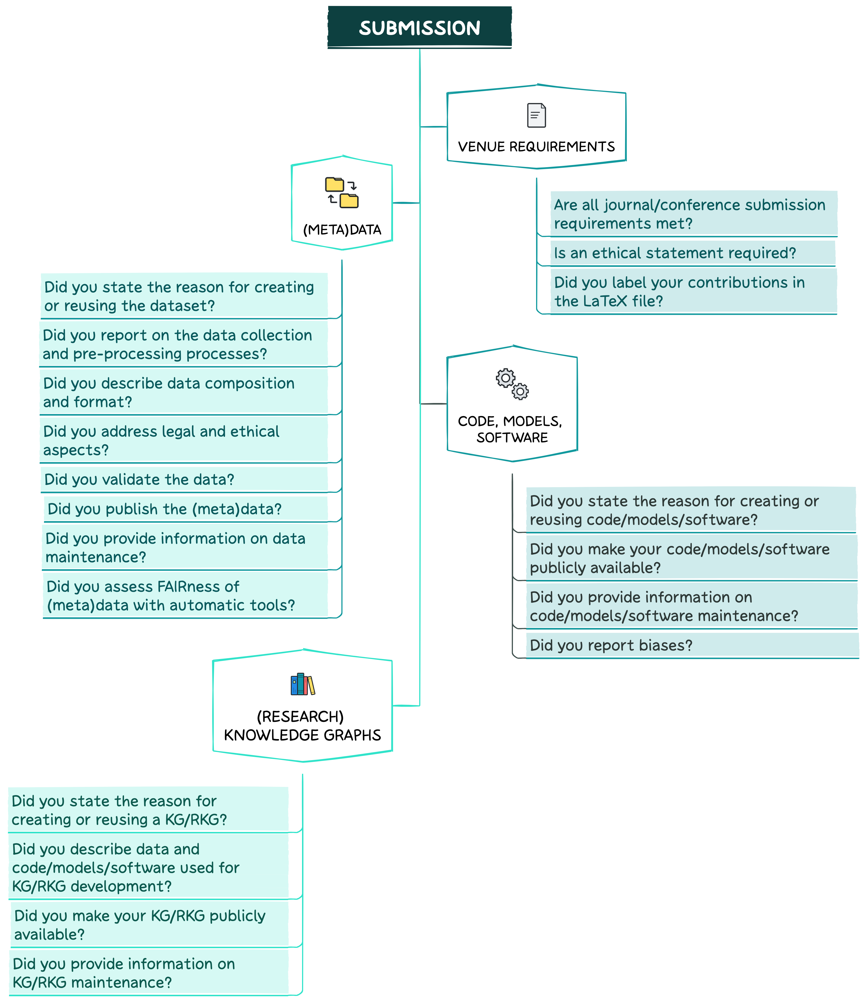

--------------------------------------------------------------------------------------------

  
  Are you about to submit your paper?
 

 

In this section, you will find recommendations on what should be done when you are writing your paper and planning to submit it to your selected venue. Take a look at the key questions below.

### Venue Requirements
--------------------------------------------------------------------------------------------

Make sure that all journal/conference submission requirements are met, e.g.:
1. In case of a double-blind review, ensure that your paper does not contain information which reveals your identity (directly or indirectly):
* Remove any identifying information from your paper. These can include titles, author names, affiliations and emails, acknowledgements, conflict of interest statements, and project funding details.
* Do not include links pointing to your personal repository with code/(meta)data in a paper.
* Use the third person to refer to your previous work.
* Make sure that figures and tables do not include any references to authors’ affiliations.
* Ensure that file names and properties are also anonymised.
* It is better not to share the non-anonymous pre-print of a manuscript (e.g., in [arXiv](https://arxiv.org)) before the anonymity period expires.
2. If applicable, do not forget to include an ethical statement.
3. In case you are using LaTeX, make sure to label your contributions (e.g., research problem, objective, method, etc.) in the LaTeX file using the [SciKGTeX](https://ctan.org/pkg/scikgtex?lang=en) package. This will allow an automatic extraction and import of the mentioned (meta)data to any KG/RKG.

### (Meta)data
--------------------------------------------------------------------------------------------

#### Motivation
State the reason for creating or re-using a dataset, e.g., for a specific task or a gap in the research field that needed to be filled.

#### Data composition and format
1. Describe your data type (raw vs pre-processed).
2. State the type/format of instances in your data (e.g., text documents, images, videos, audio files; PDF, CSV, HTML, etc.).
3. Make sure to report the language of any linguistic data, even if you are reusing common datasets or benchmarks (#benderrule).
4. Provide information about the total number of observations and (if applicable) label distribution.
5. Describe data with rich (meta)data:
* (Meta)data should clearly and explicitly include the persistent identifier (PID). For more details on PIDs, take a look at the [FAIRCOOKBOOK](https://faircookbook.elixir-europe.org/content/recipes/findability/identifiers.html).
* (Meta)data should be provided in a formal, accessible, shared, and broadly applicable language for knowledge representation (you can use RDF, OWL, DAML+OIL or JSON LD). There are many tools for converting non-RDF data to RDF, e.g., [ConverterToRdf](https://www.w3.org/wiki/ConverterToRdf) and [RdfAndSql](https://www.w3.org/wiki/RdfAndSql).
* (Meta)data should include qualified references to other (meta)data. You should establish meaningful links between datasets by clearly stating i) whether one dataset builds on another dataset, ii) whether additional datasets are needed to complete a given dataset, and iii) whether any complementary information is stored in a different dataset.
* If applicable, provide details on train/validation/test splits of your dataset.

#### Data collection 
1. Describe the data collection method (e.g., manual human annotation/automatic/semi-automatic/API). In the case of human annotation:
* Describe the annotator recruitment process. In the case of data annotation through crowdsourcing, explicitly specify the name of the platform utilised in the process.
* Provide information about annotators (e.g., crowdworkers, students, linguists; the number of annotators, their age, demographic details, etc.).
* Discuss how annotators were paid and if such payment is adequate given the annotator demographic (e.g., country of residence and level of experience).
* Report the full text of instructions/annotation guidelines given to participants.
* Describe the means and frequency of communication with annotators.
* Provide the tagsets/schemas used for annotation.
* Describe/reference annotation tool(s) used (with version details).
* Provide the IAA measure and score.
* State whether and how consent was obtained from people whose data was used/curated. For instance, if data was collected via crowdsourcing, did you explain to the crowdworkers how the data would be used?
2. Specify the timeframes for both the data collection process and the contents of the dataset.
3. State the data source(s) (e.g., Twitter, Facebook, Reddit). If data was collected by third parties, do not forget to cite authors/creators.
4. Indicate  whether your dataset comprises all instances or if it is a representative sample. If it is the latter, elaborate on the employed sampling strategy (e.g., deterministic, probabilistic, etc.).
5. State whether there is any missing information in the dataset and provide reasons for its absence. This does not include intentionally dropped instances. It might include redacted text or withheld documents.
6. Ensure that all files are clearly labelled so readers understand their contents and the differences between them.
7. Report whether there are any known errors, sources of noise, or redundancies in your dataset.

#### Data pre-processing 
1. Describe your pre-processing steps (e.g., tokenisation, part-of-speech tagging, stopwords removal, resolving imbalanced data classes, etc.).
* Report packages used with their versions, parameter settings, and accessibility (free/commercial/limited access).
* Cite the original work for packages used in your code. If no paper exists, include a URL/Digital Object Identifier (DOI)/PID to the website or the repository.
* If you modified an existing library, report the changes you made.
2. State whether raw data is available in addition to a cleaned dataset.

#### Legal/ethical considerations
In case data falls under legal/ethical restrictions:
1. If your dataset relates to people or was generated by people, state whether they were informed about the data collection and consented to it.
2. Report whether your dataset contains sensitive/confidential/personal information (e.g., names, phone numbers, credit card numbers, addresses, user names, etc.).
3. If it does, describe the measures taken to protect it. Explain how you de-identified/anonymised/pseudonymised data (e.g. by replacing personal identifiers with artificial identifiers or pseudonyms). Explain which anonymisation tool you used (e.g., [ARX](https://arx.deidentifier.org), [CloverDX](https://www.cloverdx.com/data-anonymization), [docbyte](https://www.docbyte.com/anonymization/), [amnesia](https://amnesia.openaire.eu), [BizDataX](https://bizdatax.com), [g9](https://www.esito.no/en/promo-g9/)).
4. If applicable, make sure that a dataset complies with the EU General Data Protection Regulation (GDPR).
5. State whether your data contains information that might be considered inappropriate or offensive. Describe how you checked offensive content (e.g., with a script or manually on a sample).

#### Data distribution
1. Assign a PID to your (meta)data.
2. Store (meta)data in an appropriately certified data repository and provide a link/DOI in your paper. You can assign a DOI to (meta)data by using platforms such as [DataCite](https://datacite.org) or [da|ra](https://www.da-ra.de).
* Choose either a discipline-specific or a general-purpose repository (e.g., [figshare](https://figshare.com), [Harvard Dataverse](https://dataverse.harvard.edu), [Open Science Framework](https://osf.io), [Dryad Digital Repository](https://datadryad.org/stash), [Open Science Framework](https://osf.io), [Zenodo](https://zenodo.org), [ELG](https://live.european-language-grid.eu)). See also *Services Lifecycle* on the [NFDI4DS](https://www.nfdi4datascience.de/services/all/) webpage, [Nature's](https://www.nature.com/sdata/policies/repositories#general) list of recommended data repositories, [re3data](https://www.re3data.org), [NIH-supported domain-specific repositories](https://www.nlm.nih.gov/NIHbmic/domain_specific_repositories.html), and [Data repositories](https://oad.simmons.edu/oadwiki/Data_repositories).
* Choose a repository based on its data access type (full/restricted/prohibited). Follow the principle *"As open as possible, as closed as necessary"*.
* Make sure that (meta)data is registered or indexed in a searchable resource. This makes your dataset accessible to other researchers in the future.
* Make sure that (meta)data is retrievable by its identifier using a standardized communications protocol which is open, free, and universally implementable. The protocol should allow for an authentication and authorisation procedure where necessary (e.g., HTTPS).
* If your (meta)data does not have an accompanying file and, therefore, cannot be assigned a DOI, use its URL as an identifier.
* Remember that (meta)data should be accessible, even when the data is no longer available.
* Link (meta)data to your paper.
3. State whether your dataset is already available. If not, explain when it will be released.
4. State the type of access to your dataset and why it was chosen (full/restricted/prohibited). 
>
>If constrained: Conditions of access must be described precisely, including contact details for access requests, timeframe for response to requests, restrictions imposed on data use via data use agreements, and fees. 
>
>If prohibited: Publish (meta)data.
>
5. Publish data under a licence and provide its details. For instance, you can choose between Creative Commons (CC) and Open Data Common (ODC) licences. The difference between those is explained [here](https://wiki.creativecommons.org/wiki/Data#What_is_the_difference_between_the_Open_Data_Commons_licenses_and_the_CC_4.0_licenses.3F). There are also data licences developed for a specific use case or community (e.g., [Norwegian License for Open Government Data](https://data.norge.no/nlod/en/2.0)). 
* In case you are using an existing dataset, state the original licence.
* If you collected data from a particular source (e.g., website or social media API), you should, first of all, respect and also state the copyright and terms of service of that source.
6. State whether a dataset falls under privacy/ethical/legal/copyright restrictions (see *Legal/ethical considerations* above).
7. If possible, release both raw and cleaned datasets.
8. Provide information about funding.
9. Once you publish the paper, consider adding it to a RKG such as the [ORKG](https://orkg.org) or [OpenAIRE Graph](https://graph.openaire.eu).

#### Data validation 
1. Describe whether a dataset has been already applied for any tasks. If yes, list those tasks and report the results to allow others to compare.
2. For quality assessment tools consult *Services Lifecycle* on the [NFDI4DS](https://www.nfdi4datascience.de/services/all/).

#### Data maintenance 
1. Provide information on who is supporting/hosting/maintaining your dataset (e.g., email address, DOI).
2. State whether your dataset will be updated. If yes, describe how often and by whom updates will be maintained as well as how they will be documented and communicated (e.g., via mailing list, GitHub, etc.). Do not forget about DVC.
3. If applicable, describe how others could extend, augment or build on your dataset (e.g., through pull requests on GitHub). State the process for tracking and assessing the quality of such contributions.

>Before submitting a paper, you can assess the FAIRness of your (meta)data with the following tools: 
>* [FAIR Enough](https://fair-enough.semanticscience.org)
>* [FAIR Test Library](https://maastrichtu-ids.github.io/fair-test/)

### Code, models, and software
----------------------------------------------------------------

#### Motivation
State the reason for creating or reusing code/models/software.

#### Distribution 
1. Make your code, models or software publicly available. Publish them in an appropriate, recognised and trusted repository. We encourage the use of open source and open access repositories which guarantee the persistent identification, long-term availability, and authenticity protection of digital artefacts (e.g., [Software Heritage](https://www.softwareheritage.org)). 
2. Publish code/models/software with rich (meta)data using an appropriate (meta)data format (e.g., [CodeMeta.json](https://github.com/codemeta/codemeta) and [Citation File Format](https://citation-file-format.github.io)).
3. Include a link to your repository directly in your paper.
4. Include a fine-grained documentation:
* Provide information on code/models/software names and their versions, parameters, hyper-parameters, methods used to select the best hyper-parameter configuration and if applicable, the exact number of training and evaluation runs.
* If applicable, provide also information on the data used for model training and evaluation along with a description of the dataset selection procedure.  
* If you used existing packages (e.g., for normalisation, evaluation, etc.): i) Report the names/versions of models/packages, implementation, parameter settings, and accessibility (free/commercial/limited access); ii) Cite the original work for those packages (consult [Software Citation Checklist for Authors](https://elib.dlr.de/133078/1/software_citation_checklist_for_authors.pdf)). If no paper exists, include a URL/DOI to the website or repository.
* Provide usage examples (in a README file, Jupyter notebooks, or [Docker](https://www.docker.com) containers). These should contain information on, e.g., how to run scripts/tests.
* Include a sample input and output for your system.
* Report the feature encoding method.
* Report the feature selection method: manual (conducted by domain experts) or data-driven selection (clustering, semi-supervised learning, etc.).
* If applicable, include a table of results (e.g., model performance and comparison with similar models), describing the measure(s) or statistics used.
* State the specification of dependencies.
* Describe an average runtime for each result or estimated energy cost (e.g., GPU hours, the amount of parallelism across GPUs, the size of the GPUs).
* Provide a description of the computing infrastructure used (hardware and software).
* Report whether there are any issues in the code (bugs).
* Provide contact details and recommended citation, e.g., in a README file or in a separate CITATION file (following the standard citation style for your community).
5. Publish your code under a licence approved by the open source initiative:
* Free software licences are usually divided into two broad categories: Copyleft (e.g., GPL, AGPL) and permissive (e.g., BSD, MIT, Apache). The main difference between the two is that a copyleft licence forbids proprietisation, thus not allowing commercial use of any modified versions of the source code/software. We recommend using one of the permissive licences to attract more contributors (including companies), maximise use cases of your code/models/software, and promote modifications and developments of your original work.
6. Make sure the code can be run out of the box (time- and machine-independent). Make use of [Docker](https://www.docker.com) containers and eventually consider publishing the docker container through a community platform such as [ELG](https://live.european-language-grid.eu).
7. State whether external contributions are allowed. Explain clearly how to contribute (e.g., through pull requests on GitHub). Make sure that all updates go through a review process before being added to the package.

#### Maintenance 
1. Constantly update the code to prevent deprecation (code rot).
2. Register and document every release version of your package. For every release, do not forget to mention the authors.
3. Assign a unique PID (e.g., DOI) to each version.

#### Biases
In case you report biases make sure to:
1. Explicitly state the definition of bias you are following.
2. State a single and clear motivation including normative reasoning. Explain clearly why a model behaviour that is described as biased is harmful, in what ways, and to whom.
3. Describe the quantitative techniques for measuring or mitigating bias. Make sure that those techniques are well grounded in the relevant literature on bias outside of NLP. 
4. Describe potential sources of biases. Make sure to focus on a broad range of those but not just on model predictions (e.g., task definitions, annotation guidelines, and evaluation metrics).

### (Research) Knowledge Graphs
--------------------------------------------------------------------------------------------

#### Motivation
State the reason for creating or reusing a KG/RKG, e.g., for a specific task or a gap in the research field that needed to be filled.

#### Data and code/models/software
1. Provide information on data used for your KG/RKG construction and development.
2. Describe the data collection and pre-processing processes. If you used existing data, cite the original work.
3. State the type/format of instances in your KG/RKG (e.g., text documents, images, videos, audio files; TXT, JPEG, MP3).
4. Make sure to report the language of any linguistic data, even if you are reusing common datasets or benchmarks (#benderrule).
5. Provide information about the total number of observations and (if applicable) label distribution.
6. Provide information on code/models/software used for KG development. State names, versions, parameters, hyper-parameters, methods and if applicable, the exact number of training and evaluation runs. If you used existing packages, cite the original work.
 

#### Distribution 
1. Make your KG/RKG publicly available. 
2. Publish your KG/RKG under an open-access licence.
3. Assign a unique identifier (URI) to every entity in the KG/RKG.
4. Select and use a standardized knowledge representation language (e.g. RDF, OWL, DAML+OIL or JSON LD).
5. Normalize the types and relations using an appropriate vocabulary/ontology. Assign URIs to your ontologies to make them accessible and easy to differentiate from already existing vocabularies:
  * Use permanent URIs, ensuring their long-term availability. Permanent URIs redirect to the actual point of storage of the target resource. Thus, even if the target resource is moved, only its location should be updated not its URI.
  * Choose a short and simple name to make it easy for others to remember.
  * Make sure that the name of your ontology does not overlap with existing vocabularies.
  * Don’t forget about VC. We encourage you to follow the [Semantic Versioning Principles](https://semver.org).
* Generate 2 types of (meta)data for the ontology using a standardised knowledge representation language. 
>
>Type I: (Meta)data associated with the ontology itself. It is aimed to provide an overview of your ontology and understand its usage conditions and provenance. It usually includes information on the license type, creators, contributors, creation date, previous versions, namespace URI, version IRI, namespace prefix, title, description, and citation. 
>
>Type II: (Meta)data associated with ontology elements, namely classes, objects, datatype properties, and individuals. It is recommended to provide at least a human-readable label and definition for each ontology term. Additional properties could be the term usage examples, its status (deprecated or under discussion), and the rationale for its inclusion in the ontology.
>
* Provide a human-readable documentation (e.g., as HTML). For instance, as a starting point you can use [WIDOCO](https://github.com/dgarijo/Widoco) for documentation generation.
* Create a visualisation for your ontology. A graphical representation will contribute to a better understanding of the ontology structure, relations, and usage. 
* Make the ontology and its documentation available to the community. Use either domain-specific or domain-generic registries (e.g., [Linked Open Vocabularies](https://lov.linkeddata.es/dataset/lov/)).
6. Provide (meta)data for your KG/RKG:
* Document the provenance and context of each assertion of your KG.
* Use common (meta)data schemas (e.g., [schema.org](https://schema.org)).
* If possible, state the number of triples, language, and vocabularies used, metamap.
7. If applicable, make links to other published resources.
8. Publish related (meta)data in an appropriately certified archive. 
9. Create programmatic access points via APIs.

#### Maintenance 
1. Provide information on who is supporting/hosting/maintaining your KG/RKG.
2. State whether a KG/RKG will be updated. If yes, describe how often and by whom updates will be maintained as well as how they will be documented and communicated (e.g., via mailing list, GitHub, etc.). Do not forget about VC.
3. If applicable, describe how others could extend, augment or build on your KG/RKG (e.g., through pull requests on GitHub). State the process for tracking and assessing the quality of such contributions.

>### tl;dr
><strong>Venue requirements:</strong>
>
>Go over all the requirements for your venue, which are usually available on their webpage. Among those, if the venue requires anonymisation, make sure your submission does not include or link to any of your personal information. Don’t forget about including an ethical statement if needed and labeling contributions in your LaTeX source files using the SciKGTex package!
>
><strong>(Meta)data:</strong>
>
>When you are writing about your (meta)data, make sure to address the following: why you created/reused data, how your data is composed and formatted, how your data is collected and pre-processed, how you are distributing and maintaining your data, and how you validate your data. If applicable, remember to mention any legal or ethical considerations of your data. Finally, it’s always good to evaluate and report the FAIRness of your (meta)data with available tools.
>
><strong>Code, models, and software:</strong>
>
>When writing about your code/model architecture/software, remember to include the following: why you created/reused code/models/software, how you are distributing your code/models/software, and provide a link to both your code/models/software and the respective metadata. Don’t forget to document your code and publish it under an appropriate license; state clearly whether external contributions are allowed. Avoid code rot by maintaining your code. Finally, report biases in a clear manner.
>
><strong>(Research) knowledge graphs:</strong>
>
>State clearly why you are reusing or creating a KG/RKG. Follow previous recommendations regarding (meta)data and code/models/software. Write clearly how you are distributing your KG/RKG and what resources it is linked to. Finally, don’t forget to mention how you are planning to maintain your KG/RKG.
{: .block-tip }
