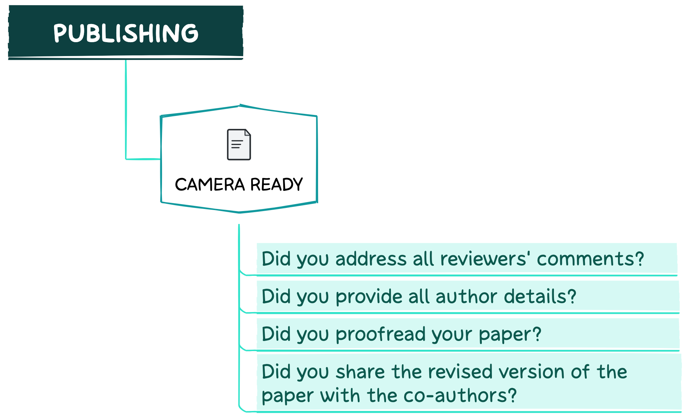

  
  Are you ready to publish your paper?

 

Congratulations on having your paper accepted! 

In this section, you will find a few recommendations for submitting the final version of your paper. However, before delving into the tips, take a look at the questions below.

 

 

### Camera Ready
--------------------------------------------------------------------------------------------

1. Make sure to address all comments from reviewers. If any additional calculations or model training were performed, ensure that relevant information is updated not only in the paper but also in the documentation for (meta)data, code, models, software, and KGs/RKGs.
2. Ensure that all author details are provided correctly.
3. Carefully check the pre-print version of your paper. Make sure that no mistakes were made by the editors (e.g., equations and references are correct and in the right place).
4. Do not forget to share the revised version with your co-authors.

>### tl;dr
>Make sure all reviewer comments are addressed and proofread your paper for grammar mistakes and typos. We recommend asking colleagues to review your paper or using tools for grammar and spelling correction, especially if English is not your native language.
{: .block-tip }